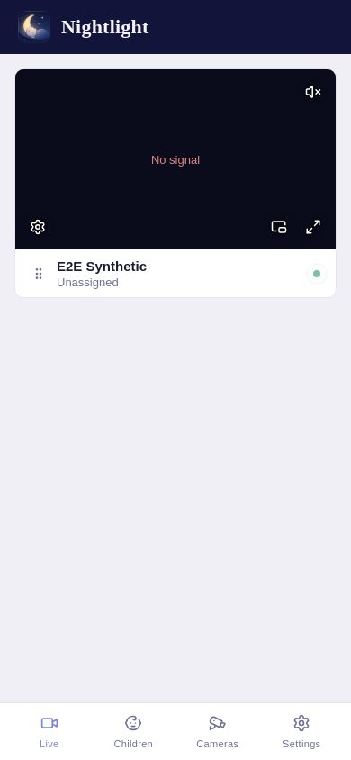
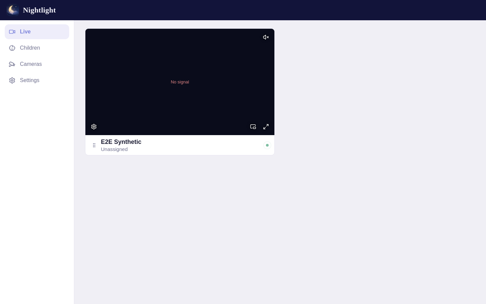
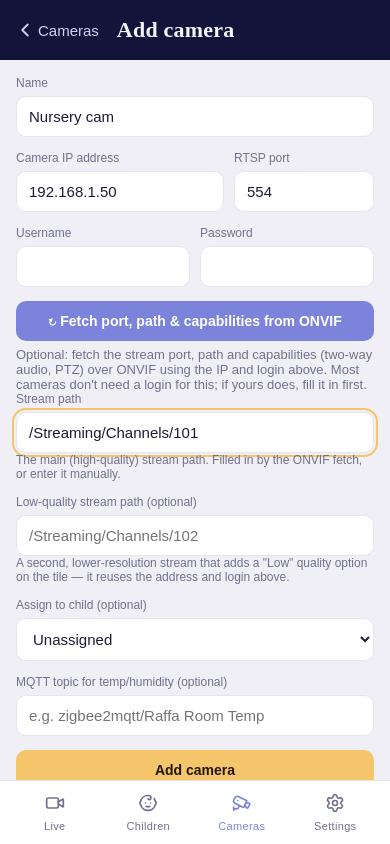
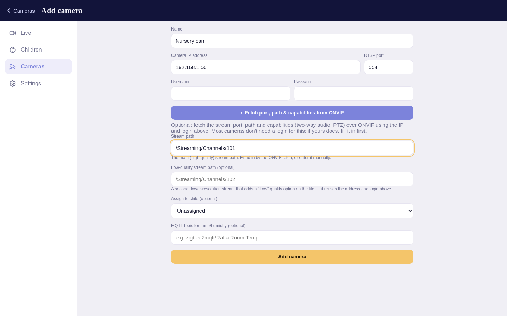
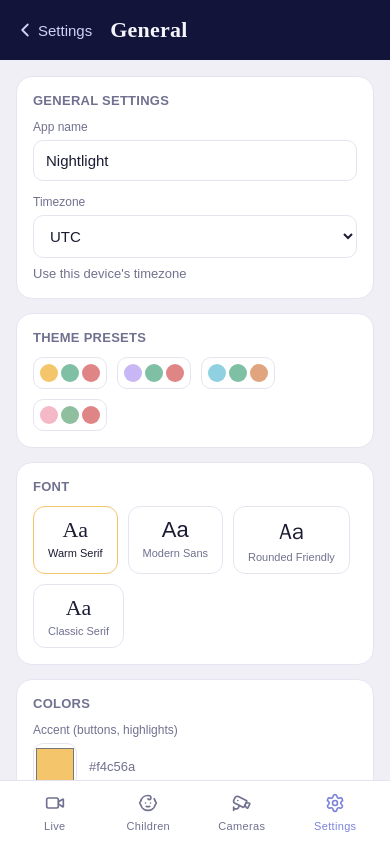
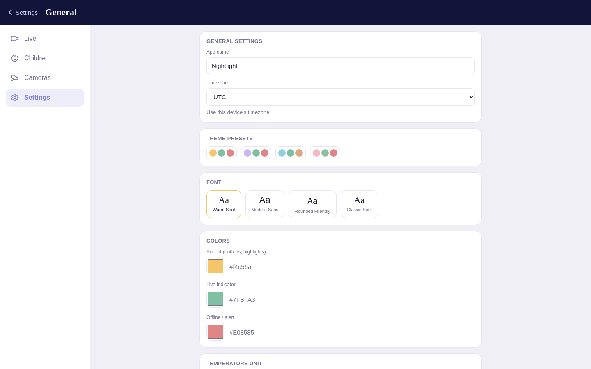

# Nightlight — visual walkthrough

A quick tour of the app's main screens. For installation, configuration, and the full
feature reference, see the [main README](../README.md).

> The screenshots below are **generated automatically** by the end-to-end test suite
> (`e2e/playwright/tests/05-screenshots.spec.js`), so they stay in sync with the real UI
> rather than drifting. See [e2e/README.md](../e2e/README.md#refreshing-the-documentation-screenshots)
> for how to refresh them.
>
> Each screen is shown at **both form factors**, because the layout genuinely changes: below
> 1200px wide the navigation is a bottom tab bar, and at 1200px and up the same component
> becomes a left sidebar rail.

## The nursery dashboard

The home screen is a live grid of camera tiles. Each tile plays low-latency video and shows
the camera's name, which child it's assigned to, a connection indicator, and controls for
audio, fullscreen, picture-in-picture, and stream quality. Tiles can be dragged to reorder.

On a phone, with the bottom tab bar:

On a desktop browser the tabs become a sidebar and the tiles lay out in a wider grid:

> These captures come from the automated test environment, which has a synthetic camera and
> no real video source behind the tile — hence the "No signal". On a real deployment the
> tile shows the camera's live feed.

## Adding a camera

Cameras are added by their address — IP, RTSP port, stream path, and credentials — or
auto-filled by IP over ONVIF. You can also set an optional low-quality sub-stream and
two-way-audio credentials here.

## Settings

Admins can theme the app (name, colors, font), set the timezone and temperature unit, and
connect an MQTT broker to show room temperature/humidity on each tile.

## Push notifications

Nightlight can push a motion alert to your phone even when the app is closed — through your choice of
**Pushover, ntfy, Gotify, or your own Firebase project** (nothing is shared through a Nightlight cloud).
It's optional and off by default. See **[notifications.md](notifications.md)** for the one-time setup.
