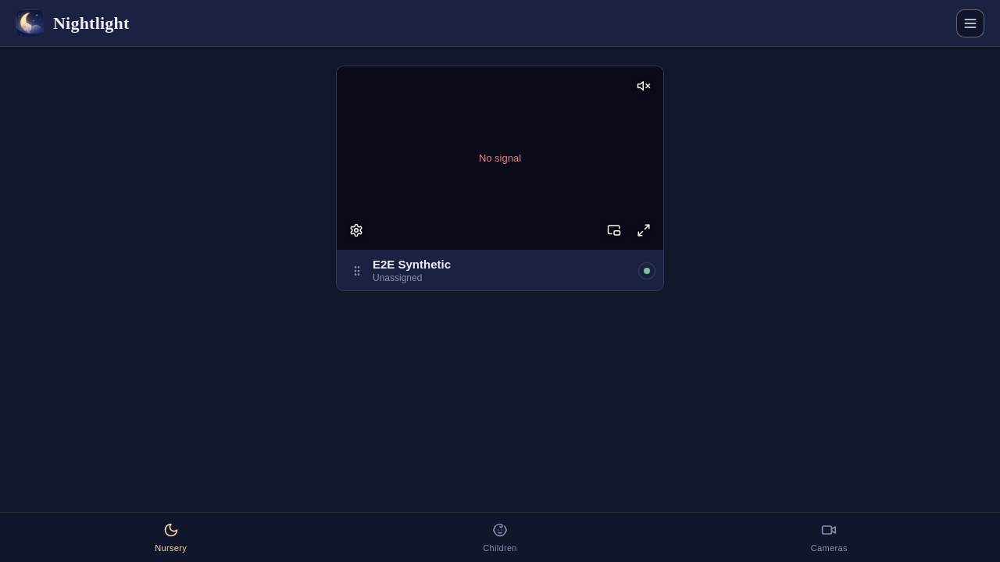
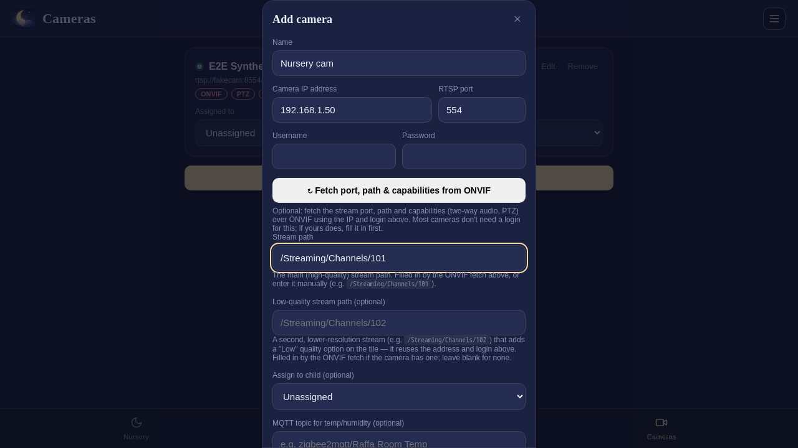
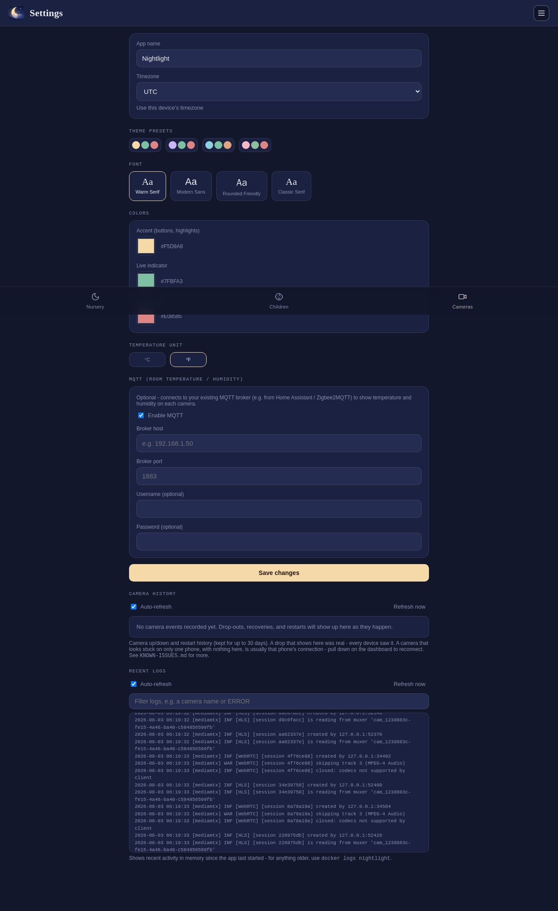

# Nightlight — visual walkthrough

A quick tour of the app's main screens. For installation, configuration, and the full
feature reference, see the [main README](../README.md).

> The screenshots below are **generated automatically** by the end-to-end test suite
> (`e2e/playwright/tests/05-screenshots.spec.js`), so they stay in sync with the real UI
> rather than drifting. See [e2e/README.md](../e2e/README.md#refreshing-the-documentation-screenshots)
> for how to refresh them.

## The nursery dashboard

The home screen is a live grid of camera tiles. Each tile plays low-latency video and shows
the camera's name, which child it's assigned to, a connection indicator, and controls for
audio, fullscreen, picture-in-picture, and stream quality. Tiles can be dragged to reorder.

> This capture comes from the automated test environment, which has a synthetic camera and
> no real video source behind the tile — hence the "No signal". On a real deployment the
> tile shows the camera's live feed.

## Adding a camera

Cameras are added by their address — IP, RTSP port, stream path, and credentials — or
auto-filled by IP over ONVIF. You can also set an optional low-quality sub-stream and
two-way-audio credentials here.

## Settings

Admins can theme the app (name, colors, font), set the timezone and temperature unit, and
connect an MQTT broker to show room temperature/humidity on each tile.

