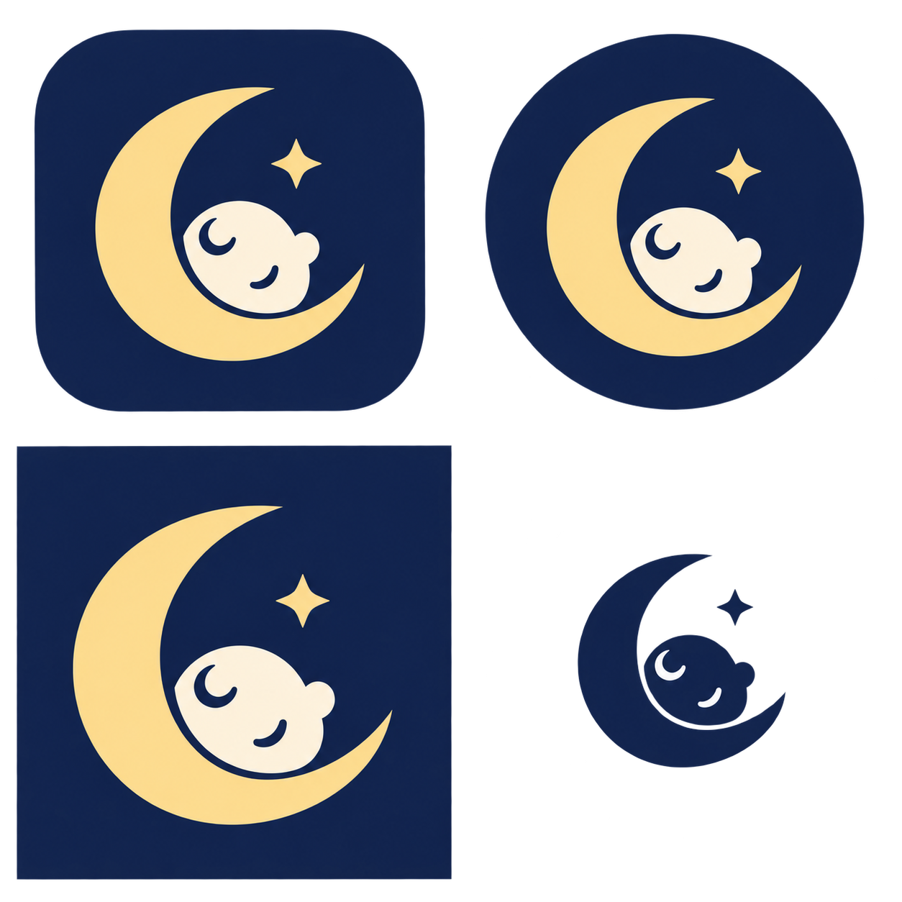
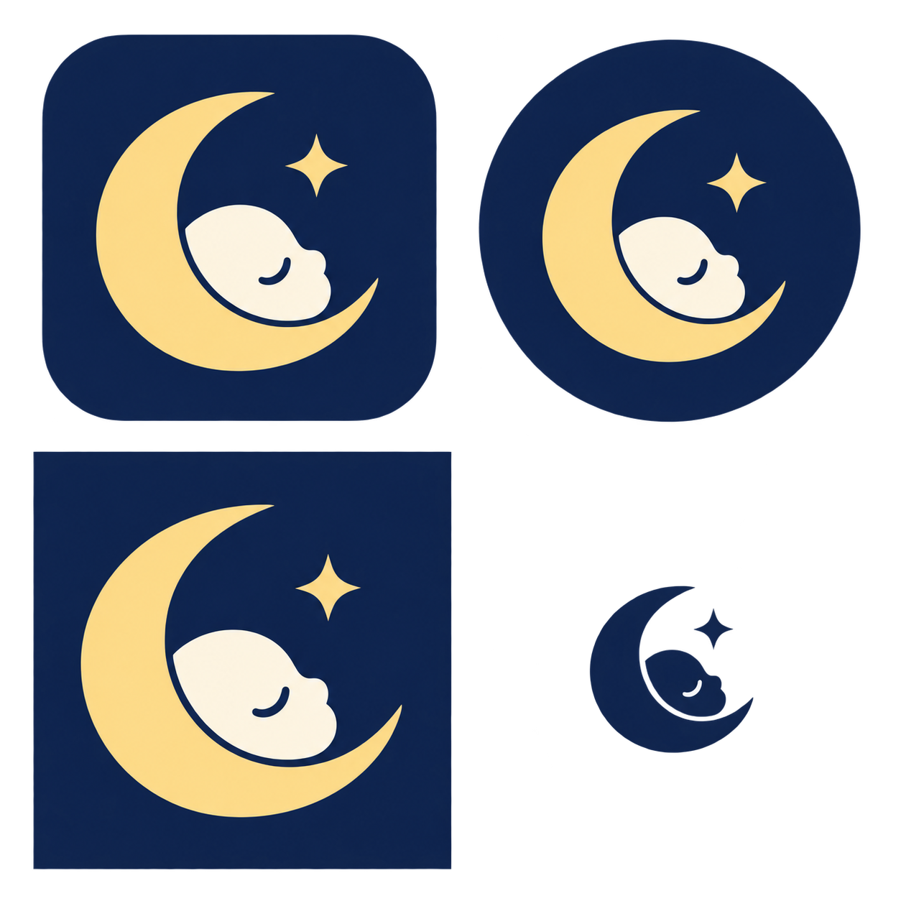
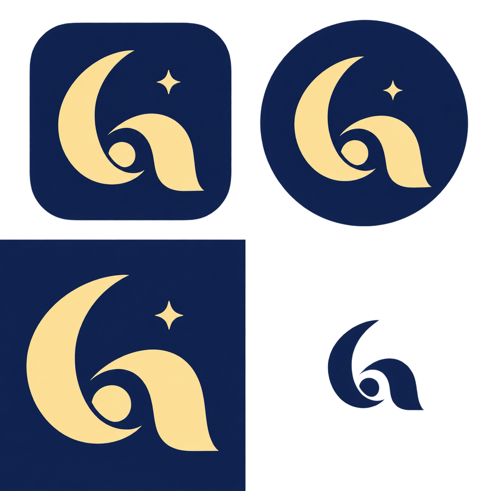

# Nightlight simplified logo concepts

These are exploratory sketches, not production assets. They test how a simpler identity
could work across the Android and iOS app icons, iOS Now Playing artwork, album art, and a
small monochrome glyph. No application assets have been replaced.

Each board uses the same layout:

- top left: iOS app icon;
- top right: Android adaptive-icon crop;
- bottom left: square, full-bleed Now Playing and album artwork;
- bottom right: small monochrome glyph.

## Concept A — Crescent cradle

This is the closest evolution of the current logo. The crescent becomes the cradle and the
baby is reduced to a head, two sleep marks, and an ear. It retains warmth and recognition,
but the face still carries more detail than the other options.

## Concept B — Negative-space baby

The sleeping profile sits inside the crescent as negative space. This is the strongest
general-purpose direction: it is recognizable as Nightlight, remains legible at small sizes,
and can be reduced to one color. The face and star should be simplified one more step before
production artwork is drawn.

## Concept C — Abstract night mark

This combines a crescent, a protective curve, and a small head into a more abstract symbol.
It is the most distinctive and scalable option, although the baby-monitor meaning is less
immediate and would need testing with existing users.

## Suggested direction

Develop Concept B first and keep Concept C as the alternative. A production pass should be
redrawn as vector paths on a fixed geometry rather than tracing the generated pixels.

The final asset family should include:

1. **Master vector mark:** flat navy, gold, and cream, plus a true one-color version.
2. **iOS app icon:** 1024 × 1024, opaque, square artwork with no rounded corners baked in;
   iOS applies its own mask.
3. **Android adaptive icon:** separate foreground and background layers, with the complete
   mark inside the adaptive-icon safe zone so circular and rounded masks do not crop it.
4. **Android legacy/PWA icons:** 512 × 512 and 192 × 192, including maskable variants.
5. **Now Playing and album art:** 512 × 512, full bleed to all edges, without an app-icon
   border or rounded-corner treatment. Keep the focal mark away from media-control overlays.
6. **Small glyph:** one color, tested at 16, 20, 24, and 32 pixels for notification and UI use.

Before replacement, preview the chosen vector at actual small sizes and through iOS and
Android icon masks. The final Now Playing image also needs its cache-buster incremented in
`frontend/src/lib/useNowPlaying.js` when the artwork changes.

## Generation notes

The boards were generated with the built-in image-generation tool using the existing
Nightlight icon only as a brand and palette reference. The prompts requested flat,
vector-friendly marks with no text, mockups, or detailed scenes. Some subtle tonal variation
remains in the sketches; remove it when creating final vector artwork.
